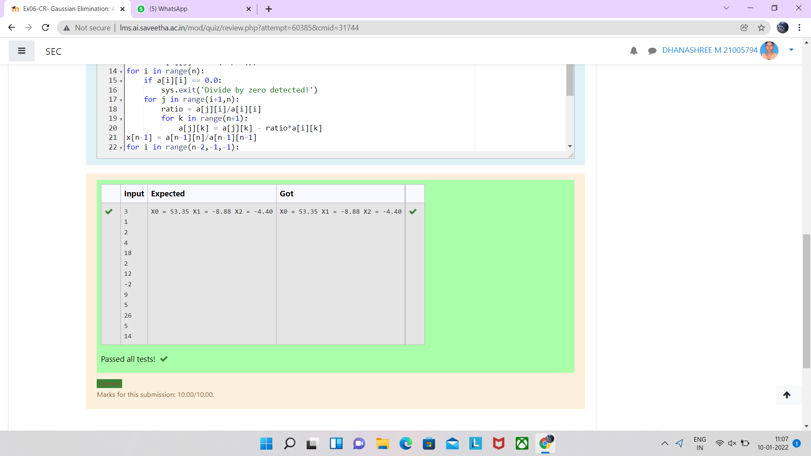

# Gaussian Elimination

## AIM:
To write a program to find the solution of a matrix using Gaussian Elimination.

## Equipments Required:
1. Hardware – PCs
2. Anaconda – Python 3.7 Installation / Moodle-Code Runner

## Algorithm
1.Find the entry in the left column with largest absolute value.this entry is called pivoting 
2. Perform the row interchange if necessary. so,that pivot in the first row.
3. Divide the first row by pivot
4. use elementary row operation to reduce the remaining entries in the first column to zero. 

## Program:
```
/*
Program to find the solution of a matrix using Gaussian Elimination.
Developed by: DJANASHREE M
RegisterNumber:21005794 

import numpy as np
import sys
n = int(input())
a = np.zeros((n,n+1))
x = np.zeros((n))
for i in range((n)):
    for j in range(n+1):
        a[i][j]=float(input())
for i in range(n):
    if a[i][i] == 0.0:
        sys.exit('Divide by zero detected!')
    for j in range(i+1,n):
        ratio = a[j][i]/a[i][i]
        for k in range(n+1):
            a[j][k] = a[j][k] - ratio*a[i][k]
x[n-1] = a[n-1][n]/a[n-1][n-1]
for i in range(n-2,-1,-1):
    x[i] = a[i][n]
    for j in range(i+1,n):
        x[i]=x[i]-a[i][j]*x[j]
    x[i]=x[i]/a[i][i]
for i in range(n):
    print('X%d = %0.2f' %(i,x[i]),end=' ')
*/
```

## Output:



## Result:
Thus the program to find the solution of a matrix using Gaussian Elimination is written and verified using python programming.

